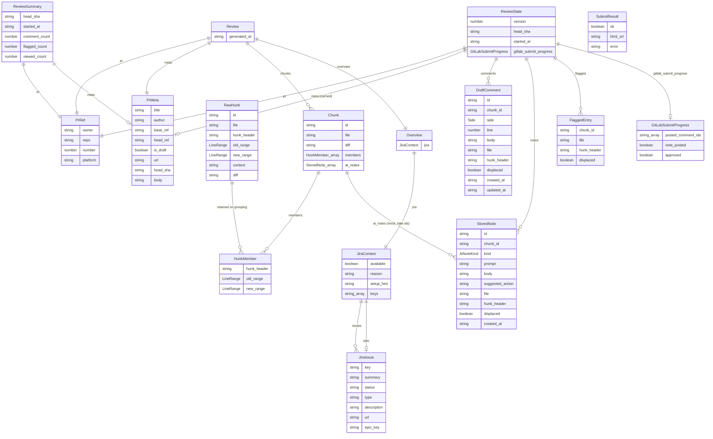
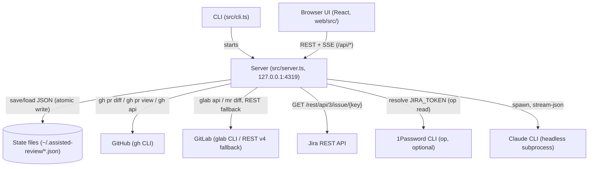
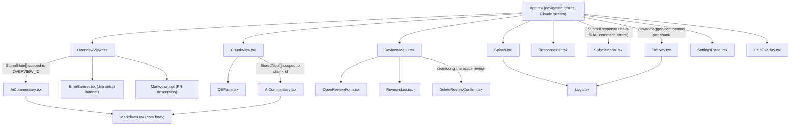

<p align="center">
  <picture>
    <source media="(prefers-color-scheme: dark)" srcset="web/public/logo-dark.svg" />
    
  </picture>
</p>

<p align="center">
  <a href="https://www.npmjs.com/package/assisted-review"></a>
  <a href="https://codecov.io/gh/moui72/assisted-review"></a>
  <!-- ardd-badge-start -->
  <a href="https://github.com/moui72/artifact-driven-dev"></a>
  <!-- ardd-badge-end -->
</p>

## What is assisted-review?

PR review fatigue is real. Large diffs overwhelm reviewers — context gets lost, subtle bugs slip through, and reviewers rush to finish. Standard GitHub/GitLab review shows everything at once with no focus and no dedicated workspace.

assisted-review fetches a PR or MR and presents it one hunk at a time in a focused browser UI. Each chunk gets its own page. Claude analyzes each chunk upfront and answers follow-up questions in a sidebar. Jira context (story + epic) appears on the overview page when configured. State persists to disk so you can resume a review across sessions.

You stay in control. Claude assists.

It is a standalone CLI: it fetches the PR/MR with `gh`/`glab`, parses the diff into chunks, and serves a paginated React UI from a localhost-only server. AI commentary streams from headless Claude Code. No data leaves your machine except the comments you choose to post.

> Status: early / in-progress — see the [changelog](./CHANGELOG.md) for what's shipped and the [roadmap](./ROADMAP.md) for what's planned.

## Requirements

- Node >= 20.18
- [`gh`](https://cli.github.com/) authenticated (`gh auth status`) — for GitHub PRs
- [`glab`](https://gitlab.com/gitlab-org/cli) authenticated, optional — for GitLab MRs. Without it, assisted-review falls back to the GitLab REST API directly using `GITLAB_TOKEN`
- [`claude`](https://claude.com/claude-code) CLI on `PATH` (for AI commentary)
- [pnpm](https://pnpm.io) — only for working on the project (not for the global install)

## Install

### Global install

Install from npm. No clone or pnpm required.

```bash
npm i -g assisted-review
assisted-review <owner/repo#N | PR URL>
```

To update: `npm update -g assisted-review`. To remove: `npm uninstall -g assisted-review`.

### From a checkout

```bash
pnpm install
pnpm build                            # compile server + bundle UI
pnpm cli <owner/repo#N | PR URL>      # fetch, serve, open the browser
```

## Configuration

### GitLab (optional)

GitHub PRs work out of the box via `gh`. For GitLab MRs, either authenticate `glab`, or set a token to use the REST API directly:

| Variable | Required | Description |
|---|---|---|
| `GITLAB_TOKEN` | Only if `glab` isn't installed/authenticated | Personal/project access token with API scope |
| `GITLAB_HOST` | No | Self-hosted GitLab instance (default: `gitlab.com`) |

### Jira (optional)

When Jira credentials are configured, the overview page pulls the referenced story and epic from the Jira REST API. Without credentials, it shows a setup banner instead.

| Variable | Required | Description |
|---|---|---|
| `JIRA_BASE_URL` | Yes | Base URL of your Jira instance, e.g. `https://your-org.atlassian.net` |
| `JIRA_USER` | Yes | Your Jira account email |
| `JIRA_TOKEN` | Yes | Jira API token |
| `JIRA_EPIC_FIELD` | No | Epic-Link custom field ID (default: `customfield_10008`) |

Variables are read from the environment with the first match winning:

1. Real environment variables (always win)
2. `$DOTENV_CONFIG_PATH`, if set
3. `./.env` in the current directory (useful in a checkout — copy `.env.example`)
4. `~/.assisted-review/.env` (user-global; use this for a global install)

All `.env` files are gitignored.

**Example `~/.assisted-review/.env`:**

```ini
JIRA_BASE_URL=https://your-org.atlassian.net
JIRA_USER=you@example.com
JIRA_TOKEN=your-jira-api-token
# JIRA_EPIC_FIELD=customfield_10008
```

### State directory

Review state is stored in `~/.assisted-review/` by default. Override with:

```bash
ASSISTED_REVIEW_STATE_DIR=/path/to/state
```

### Other environment variables

| Variable | Description |
|---|---|
| `PR_REF` | Default ref to open, used by `pnpm dev` |
| `PRELOAD_CHUNKS` | How many upcoming chunks to silently preload AI commentary for (default: `1`) |
| `PRELOAD_OVERVIEW` | Preload the overview's AI summary too (default: `true`) |
| `ASSISTED_REVIEW_NO_UPDATE_CHECK` | Skip the background npm-registry version check on startup |

### Inline env vars

You can pass configuration inline for a one-off run:

```bash
JIRA_BASE_URL=https://your-org.atlassian.net JIRA_USER=you@example.com JIRA_TOKEN=<token> assisted-review owner/repo#123
```

## Usage

```bash
assisted-review [<ref>]
```

With no ref, the server starts and shows a splash screen where you can enter a ref.

Accepts `owner/repo#123` shorthand or a full GitHub PR URL, and `namespace/repo!123` shorthand or a full GitLab MR URL (`namespace` may itself contain slashes for subgroups).

### Flags

| Flag | Effect |
|---|---|
| `--no-open` | Don't open the browser automatically |
| `--api-only` | Serve only the API (pair with `pnpm dev:web`) |
| `--port <n>` | Listen port (default 4319) |
| `--mock-ai` | Fill chunks with placeholder commentary (offline use) |

### Keyboard shortcuts

| Key | Action |
|---|---|
| `→` / `j` | Next chunk |
| `←` / `k` | Previous chunk |
| `⌘→` / `⌘←` (Ctrl on Win/Linux) | Next / previous unread chunk |
| `↵` | Mark viewed and advance |
| `esc` | Mark unread |
| `f` | Flag chunk |
| `c` | Comment |
| `a` | Ask Claude |
| `?` | Show help |

## Submitting

When you're done reviewing, hit **Submit** in the top bar to publish your review. Choose a verdict, add an optional summary, and the drafted line comments go out with it. Whole-chunk comments anchor to the chunk's last changed line.

- **GitHub**: the whole review (verdict, summary, inline comments) is posted as a single PR review via `gh api`.
- **GitLab**: each inline comment is posted as its own discussion, followed by a summary note and an optional approve — GitLab has no equivalent single-request review. Each step retries transient failures; if a comment still fails to post, the note/approve are withheld and you can retry submission without reposting what already succeeded.

If the PR/MR was force-pushed since you started, the head SHA the comments were drafted against is no longer valid. In that case, submission is blocked with a stale-SHA warning rather than posting mis-anchored comments. Re-fetch the PR/MR to re-anchor your comments to the new SHA.

## Architecture

```
src/         TypeScript backend (ESM, compiled to build/)
  cli.ts        entry: parse ref → fetch → chunks → Jira → serve
  fetch.ts · parse-ref.ts · parse-diff.ts   diff/PR ingestion (GitHub + GitLab)
  gitlab-rest.ts · gitlab-token.ts          GitLab glab-CLI-or-REST transport, token resolution
  server.ts     localhost HTTP server — see endpoints below
  state.ts      persisted review state (~/.assisted-review/<key>.json)
  investigation.ts   per-repo Claude investigation-access config + clone lifecycle
  claude.ts     headless Claude bridge (stream-json)
  submit.ts     publish drafted comments as a real PR/MR review
  jira.ts       Jira REST fetch (env-configured)
  update-check.ts    background npm-registry version check
web/         Vite + React + Tailwind UI → builds into dist/, served by the server
```

- **`cli.ts`** — entry point; parses the PR/MR ref, fetches the diff and metadata, extracts Jira keys, and hands off to the server. Starts in splash-screen mode when no ref is given.
- **`fetch.ts` / `parse-ref.ts` / `parse-diff.ts`** — fetch the raw diff and PR/MR metadata via `gh`/`glab`, parse the ref format, and slice the unified diff into reviewable chunks.
- **`gitlab-rest.ts` / `gitlab-token.ts`** — GitLab transport (prefers the `glab` CLI, falls back to the REST API v4 via `GITLAB_TOKEN`) and token resolution (raw value, `op://`, `env:`, or `cmd:` reference).
- **`server.ts`** — Node.js HTTP server providing the REST and SSE API (`/api/review`, `/api/state`, `/api/action`, `/api/claude` (SSE), `/api/submit`, `/api/reviews`, `/api/reviews/open`, `/api/auth/gitlab`, `/api/investigation-config`, `/api/config`). Serves the pre-built React UI from `dist/` unless `--api-only` is set.
- **`state.ts`** — loads and persists review state (viewed, flagged, comments, AI notes) as JSON in `~/.assisted-review/`.
- **`investigation.ts`** — per-repo config for how much repo access Claude gets during investigation (diff-only, a local checkout, full-file API reads, or a managed clone), plus clone lifecycle (cloning, refresh, pruning).
- **`claude.ts`** — spawns headless `claude` as a subprocess and streams JSON-formatted commentary back to the server.
- **`submit.ts`** — assembles drafted comments into a review payload and posts it via `gh api` (GitHub) or the GitLab discussions/notes/approve endpoints (GitLab).
- **`jira.ts`** — fetches issue and epic data from the Jira REST API using env-configured credentials.
- **`update-check.ts`** — checks the npm registry for a newer published version in the background and prints a notice on startup if out of date.

State lives in `~/.assisted-review/` (override with `ASSISTED_REVIEW_STATE_DIR`).

## Contributing

### Dev setup

```bash
pnpm install
pnpm dev        # API server on :4319 + Vite HMR on :5173
```

Open `http://localhost:5173` for the live-reloading UI. Set a default PR with `PR_REF=owner/repo#N` in `.env` (copy `.env.example`).

### Scripts

| Script | What it does |
|---|---|
| `dev` | Starts the API server and Vite HMR server concurrently |
| `build` | Compiles TypeScript (server → `build/`) and bundles the UI (→ `dist/`) |
| `build:web` | Builds only the React UI with Vite |
| `test` | Runs Vitest unit tests |
| `test:e2e` | Runs Playwright end-to-end smoke test (requires a prior `pnpm build`) |
| `test:watch` | Runs Vitest in watch mode |
| `lint` | Runs ESLint |
| `format` | Runs Prettier |

### Adding a language

Syntax highlighting is registered in `web/src/highlight.ts`. Import the language grammar from `highlight.js` there and add it to the `hljs.registerLanguage` calls.

### PRs welcome

Open a PR against `main`. CI runs lint, build, tests, and an end-to-end smoke test on every PR. Please keep commits focused and include tests for new behavior where applicable.

## Datamodel



## Infrastructure



## UI


