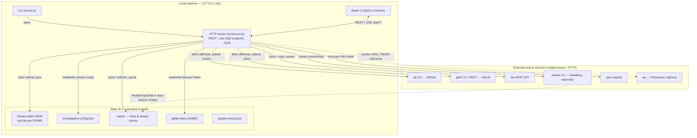
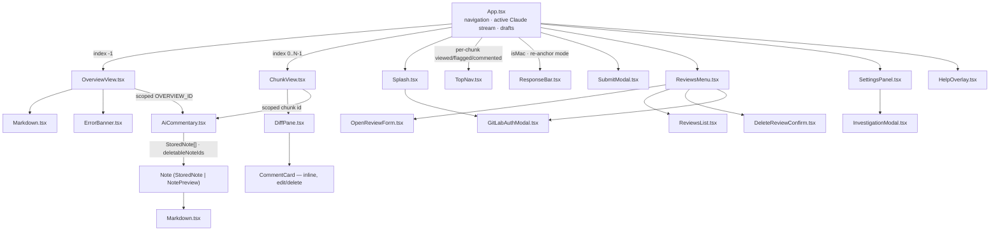

# Architecture

Diagrams generated from the ARDD artifacts in [`.project/artifacts/`](../.project/artifacts) via `/ardd-render`. See the [Architecture](../README.md#architecture) section of the README for the prose overview.

## Datamodel

## Infrastructure

## UI

