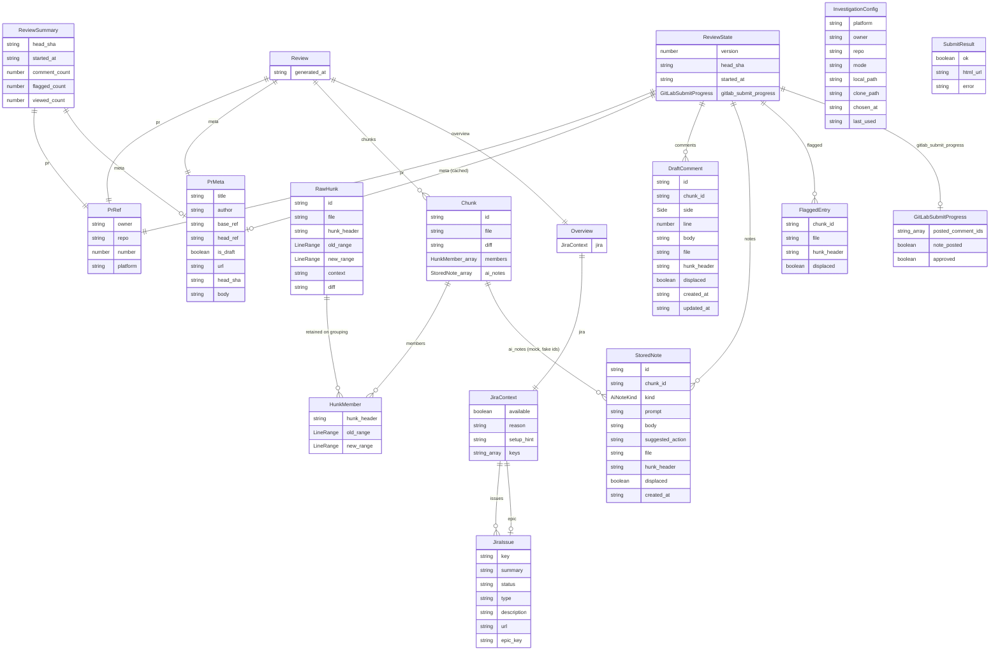
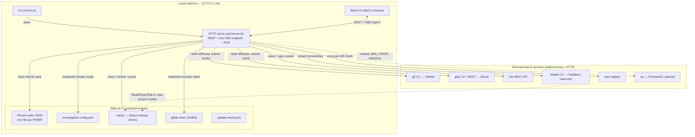
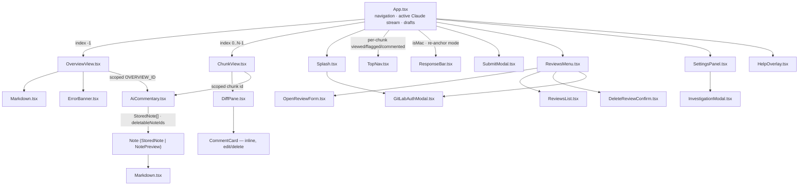

# Architecture

How assisted-review is put together: process model, backend modules, and the
three generated diagrams (data model, infrastructure, UI). The diagrams are
generated from the ARDD artifacts in
[`.project/artifacts/`](../.project/artifacts) by `/ardd-diagram` — don't edit
the Mermaid blocks by hand; the prose around them is maintained normally. For
the user-facing overview, start with the [README](../README.md).

## Process model

One command, one process, one browser tab:

1. **CLI** (`src/cli.ts`) parses the PR/MR ref, fetches the diff and metadata
   via `gh`/`glab`, parses and groups the diff into chunks, optionally pulls
   Jira context, loads (or creates) the persisted review state, and starts
   the server. With no ref, it starts straight into splash-screen mode.
2. **Server** (`src/server.ts`) is a single Node `http` server bound to
   `127.0.0.1` (default port 4319). It serves the pre-built React UI from
   `dist/` and a small JSON API under `/api/*` — REST plus one SSE endpoint
   for streaming Claude output. There is no auth layer; loopback binding is
   the protection, by design (a single local reviewer using credentials they
   already hold via `gh auth`/`glab auth`).
3. **Browser** runs the React SPA, a thin client: nearly all review state is
   server-authoritative and round-trips through the API on every mutation.

The server holds exactly one *active* review in memory at a time
(`AppContext { review, state }`). Opening a different PR/MR replaces it;
multiple *saved* reviews exist only as state files on disk, listed via
`GET /api/reviews`.

A few invariants shape everything else (see
[`constitution.md`](../.project/artifacts/constitution.md)):

- **Local-only.** The server never binds off-loopback; no data leaves the
  machine except comments the reviewer explicitly submits.
- **State mutation is a pure reducer.** `applyAction(state, action)` in
  `src/state.ts` never mutates its input; persistence is a separate atomic
  write (tmp file + `rename()`). Concurrent in-process mutations are
  serialized through a small FIFO mutex (`src/mutex.ts`).
- **External tools are subprocesses.** `gh`, `glab`, `claude`, and optionally
  `op` are invoked via `node:child_process`, never as imported SDKs. Missing
  binaries surface as actionable errors.
- **Optional integrations degrade, never crash.** Jira, AI commentary, and
  the update check each resolve to a typed "unavailable" state (setup banner,
  error note, silence) rather than blocking the core review flow.

## Backend modules

```
src/         TypeScript backend (strict, ESM, compiled to build/)
  cli.ts        entry: parse ref → fetch → chunks → Jira → serve
  env.ts        .env loading (env vars → DOTENV_CONFIG_PATH → ./.env → ~/.assisted-review/.env)
  parse-ref.ts  ref formats: owner/repo#N, namespace/repo!N, GitHub/GitLab URLs
  fetch.ts      diff + metadata via gh / glab / GitLab REST, normalized to one shape
  parse-diff.ts unified diff → RawHunk[] → grouped Chunk[]
  gitlab-rest.ts  glab-CLI-or-REST transport: pagination, retry classification
  gitlab-token.ts browser-entered GitLab token store (memory + 0600 file on disk)
  review.ts     loadReview(): assembles Review + ReviewState, runs anchor reconciliation
  state.ts      pure applyAction reducer, migrate(), atomic saveState, listReviews
  mutex.ts      in-process FIFO lock serializing state read-modify-write cycles
  server.ts     localhost HTTP server: REST + SSE API, static UI, one active review
  claude.ts     headless claude bridge: prompt builders, stream-json parsing, cancel
  investigation.ts  per-repo repo-access config for Claude + clone lifecycle/pruning
  mock-ai.ts    --mock-ai placeholder notes (offline / e2e)
  jira.ts       Jira REST fetch, ADF-to-text flattening, degrade-to-banner
  resolve-token.ts  JIRA_TOKEN indirection: op:// / env: / cmd: references
  setup-jira.ts interactive `assisted-review configure` wizard for Jira env vars
  submit.ts     publish drafted comments as a real PR/MR review
  update-check.ts   background npm-registry version check (24h cache)
  pkg-info.ts   reads this package's own name/version (update-check, CLI banner)
  types.ts      the shared type model (re-exported to the frontend)
web/         Vite + React 19 + Tailwind v4 UI → builds into dist/
```

Module notes, roughly in the order a review flows through them:

- **`fetch.ts` / `gitlab-rest.ts`** — GitHub always goes through the `gh`
  CLI. GitLab prefers the `glab` CLI and falls back to the GitLab REST API v4
  (`GITLAB_TOKEN` / browser-entered token, `GITLAB_HOST` for self-hosted);
  both paths normalize to the same `PrMeta` shape, and the REST path
  reconstructs the `---`/`+++` markers GitLab's `/diffs` endpoint omits so
  both platforms converge on the same parser.
- **`parse-diff.ts`** — wraps the `parse-diff` npm package, then
  `groupChunks()` merges adjacent same-file hunks separated by a small
  unchanged gap (default 20 lines) into `Chunk`s. That grouping step defines
  the reviewable unit the whole app operates on.
- **`review.ts` / `state.ts`** — `loadReview()` joins the freshly fetched
  `Review` with the persisted `ReviewState`, migrates old state files, and
  runs the anchor-reconciliation pass (see Datamodel below). `saveState()`
  writes atomically; `loadState()` falls back to a fresh state on any
  read/parse error rather than throwing.
- **`server.ts`** — routes: `/api/config`, `/api/review`, `/api/state`,
  `/api/action` (the single generic mutation endpoint — the `Action` union),
  `/api/claude` (SSE), `/api/submit`, `/api/reviews`, `/api/reviews/open`,
  `/api/auth/gitlab`, `/api/investigation-config`, plus static file serving
  with SPA fallback. Only one Claude stream may be in flight globally;
  opening a review or dropping the SSE connection cancels it. The full
  endpoint-by-endpoint contract is in
  [`api.md`](../.project/artifacts/api.md).
- **`claude.ts` / `investigation.ts`** — spawns
  `claude -p --output-format stream-json` with `Bash`/`Edit`/`Write`/web
  tools always disallowed. The per-repo `InvestigationConfig` decides how
  much more Claude can see: nothing beyond the diff (default), read-only
  `Read`/`Grep`/`Glob` in a local path or a managed clone, or full contents
  of changed files fetched via the platform API. Clones live under the state
  dir and are swept (temp) or idle-pruned after 30 days (persistent).
- **`submit.ts`** — GitHub: one `gh api` POST carrying the whole review.
  GitLab: per-comment discussions + summary note + optional approve, with
  retry on transient errors and persisted partial-progress so a retry never
  reposts what already landed. Both paths verify the drafted-against head
  SHA is still on the PR/MR before posting.

## Datamodel

Types are defined once in `src/types.ts` and shared with the frontend via
`import type` (re-exported from `web/src/api.ts`). Two families exist:

- **Fetched/derived, in-memory only** — `Review` and everything under it
  (`PrMeta`, `Chunk`, `JiraContext`, …), rebuilt on every open and never
  persisted.
- **Persisted** — `ReviewState` and its nested `DraftComment` / `StoredNote`
  / `FlaggedEntry`, one JSON file per PR/MR, mutated only through the
  `applyAction` reducer.

The two are joined at read time by `chunk_id`. Because chunk ids (`c1`,
`c2`, …) are unstable sequential ids, every persisted anchor also snapshots
the chunk's `file` + `hunk_header`; on each reopen, an **anchor
reconciliation** pass re-matches those snapshots against the freshly parsed
chunks — re-syncing ids where the hunk still exists, and marking entries
`displaced` (surfaced in the UI for manual re-anchoring, deletion, or
unflagging) where it doesn't. Full field-by-field detail is in
[`datamodel.md`](../.project/artifacts/datamodel.md).



## Infrastructure

No database, no hosted backend. Storage is flat JSON files under
`~/.assisted-review/` (override: `ASSISTED_REVIEW_STATE_DIR`): one state file
per PR/MR, an `investigation-config.json` map, repo clones under `repos/`,
the browser-entered GitLab token (mode `0600`), and a 24h update-check cache.
Every file follows the same atomic tmp-then-`rename()` write convention. All
external integrations sit outside the process boundary — CLIs invoked as
subprocesses (`gh`, `glab`, `claude`, `op`) or plain HTTPS (Jira, GitLab REST
fallback, npm registry) — and every optional one degrades to a typed
"unavailable" state instead of failing the review. Transport details, shape
mappings, and storage layout are in
[`infrastructure.md`](../.project/artifacts/infrastructure.md).



## UI

A single-page React 19 + Tailwind v4 app (`web/src/`), keyboard-first,
rendering exactly one review at a time — one chunk (or the overview) per
screen. `App.tsx` orchestrates everything: the navigation index (`-1` =
overview, `0..N-1` = chunk), the single active Claude stream, drafts, and the
global keyboard listener. Views and modals hang off it; the diagram below
shows the composition.

The app is a deliberately thin client: `ReviewState` is server-authoritative
and re-set from the response of every mutating call, so local React state is
mostly UI-only concerns (which modal is open, the streaming text buffer,
in-progress draft text). Theming is two independent persisted axes — palette
and light/dark mode — implemented entirely with CSS custom properties (no
`tailwind.config.js`); each palette carries a complete token set for both
modes, including syntax colors. Component-by-component detail, UI states, and
the keyboard model are in [`ui.md`](../.project/artifacts/ui.md).


